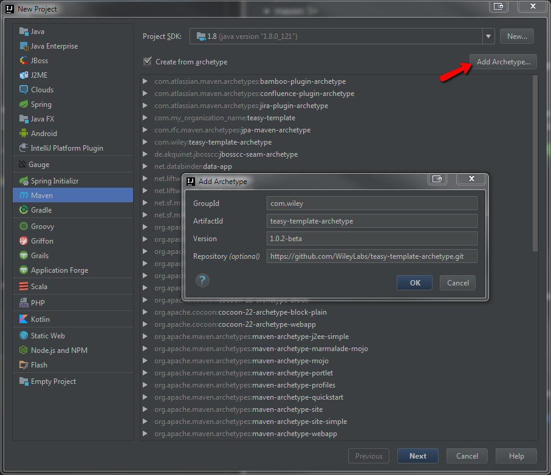
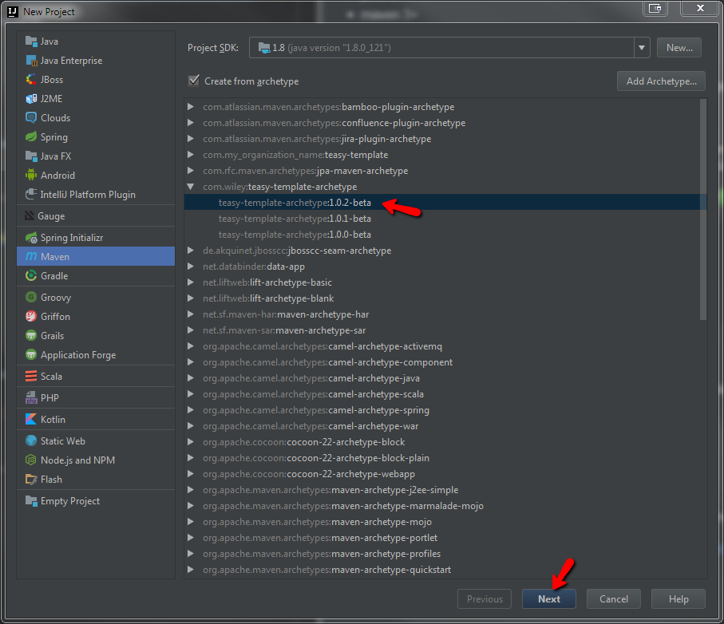
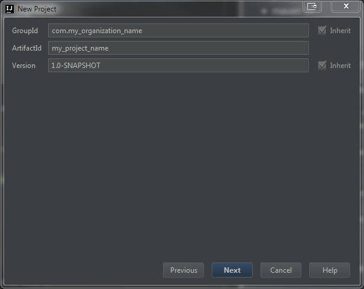
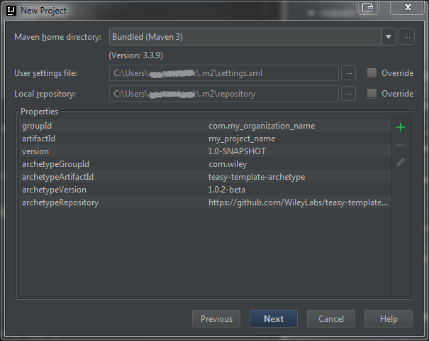
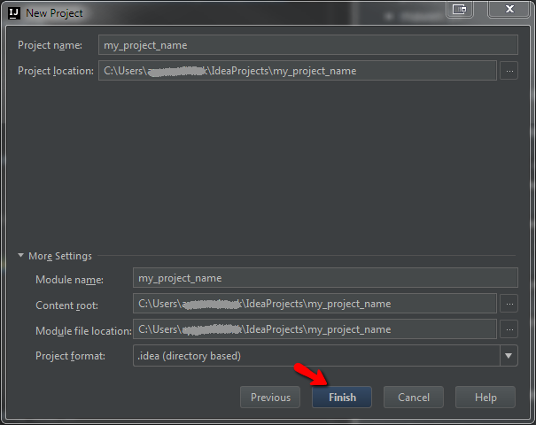

# teasy-template-archetype

This is a maven archetype template to get started using teasy from scratch.
## Description
Coming soon...
## Usage
You will need to have the following soft installed:
* java 8+
* maven 3+

#### By console:
In your console go to the folder where you want the template to be generated

run the following command:

`mvn archetype:generate -DarchetypeGroupId=com.wiley -DarchetypeArtifactId=teasy-template-archetype -DarchetypeVersion=${archetypeVersion} -DgroupId=${groupId} -DartifactId=${artifactId} -Dversion=${version}`

where 
`${archetypeVersion}` is a maven-central version , or in the `pom.xml` `<version>1.0.1-beta</version>` field e.g. `1.0.0-beta`

`${groupId}` e.g. `com.my_organization_name`

`${artifactId}` e.g. `teasy-template`

`${version}` e.g. `1.0`

all these data can be changed later in `pom.xml` of a template 

import generated project to your favourite IDE and you're ready to play with it

#### By IntelliJ IDEA:

Go to File > New > Project, then:

1. Choose Maven project, click Add Archetype, and fill all input fields with following information: 
 GroupId: com.wiley, 
 ArtifactId: teasy-template-archetype, 
 Version: 
 And click Ok.

2. Select saved archetype and click Next.

3. Fill all input fields with your project information and click next.

4. Check that all data is correct and click Next.

5. Check that all data is correct and click Finish.

The IDEA will create all needed packages automatically and ask you to add the project like maven project.

## Contributing

We're just getting started here, but please post issues if you have any!

Feel free to join our gitter chat:
https://gitter.im/teasy-test-framework/Lobby

## License

MIT
